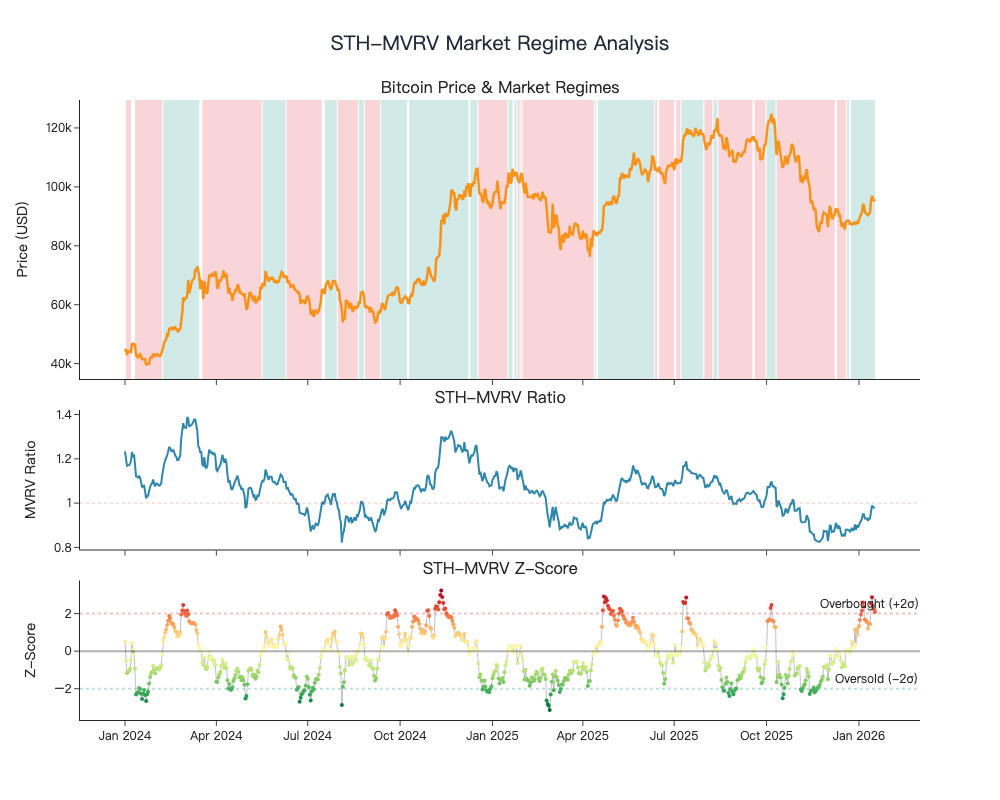
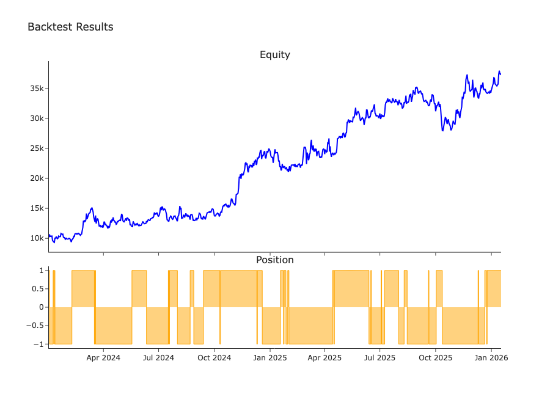

# STH-MVRV 分析报告 - 2026-01-14

## 更新日期
2026-01-14

## 指标数据（最后30行）
| datetime | sth_mvrv | close | sth_mvrv_zscore |
|----------|----------|-------|-----------------|
| 2025-12-16 | 0.8550 | 87843.98 | -0.7269 |
| 2025-12-17 | 0.8580 | 86143.76 | -0.6361 |
| 2025-12-18 | 0.8500 | 85462.51 | -0.7962 |
| 2025-12-19 | 0.8800 | 88103.38 | -0.0330 |
| 2025-12-20 | 0.8800 | 88344.00 | 0.0074 |
| 2025-12-21 | 0.8810 | 88621.75 | 0.0834 |
| 2025-12-22 | 0.8780 | 88490.02 | 0.0568 |
| 2025-12-23 | 0.8710 | 87414.00 | -0.0995 |
| 2025-12-24 | 0.8780 | 87611.96 | 0.1587 |
| 2025-12-25 | 0.8880 | 87234.74 | 0.5109 |
| 2025-12-26 | 0.8770 | 87301.43 | 0.1707 |
| 2025-12-27 | 0.8790 | 87802.16 | 0.2678 |
| 2025-12-28 | 0.9040 | 87835.84 | 1.1433 |
| 2025-12-29 | 0.8800 | 87138.14 | 0.3486 |
| 2025-12-30 | 0.9000 | 88430.13 | 1.1669 |
| 2025-12-31 | 0.8900 | 87508.83 | 0.8720 |
| 2026-01-01 | 0.9000 | 88731.98 | 1.3322 |
| 2026-01-02 | 0.9100 | 89944.70 | 1.6600 |
| 2026-01-03 | 0.9200 | 90603.19 | 1.9343 |
| 2026-01-04 | 0.9300 | 91413.49 | 2.1478 |
| 2026-01-05 | 0.9500 | 93882.55 | 2.5864 |
| 2026-01-06 | 0.9500 | 93729.03 | 2.3776 |
| 2026-01-07 | 0.9300 | 91308.05 | 1.6824 |
| 2026-01-08 | 0.9300 | 91027.12 | 1.6132 |
| 2026-01-09 | 0.9300 | 90513.10 | 1.5543 |
| 2026-01-10 | 0.9200 | 90386.65 | 1.2075 |
| 2026-01-11 | 0.9300 | 90827.46 | 1.4781 |
| 2026-01-12 | 0.9300 | 91192.99 | 1.4418 |
| 2026-01-13 | 0.9700 | 95321.78 | 2.5378 |
| 2026-01-14 | 0.9900 | 96929.33 | 2.8644 |

## 回溯检验的业绩指标
- Total Closed Trades: 50
- Win Rate: 52.00%
- Profit Factor: 5.12
- Avg PnL (Closed): 3.46%
- Open Positions: 1
- Total Return: 273.33%
- CAGR: 91.09%
- Sharpe Ratio: 1.33
- Max Drawdown: -23.03%

## 回溯检验的历史交易（最后10笔）
| status | entry_time | entry_price | exit_time | exit_price | position | pnl_pct |
|--------|------------|-------------|-----------|------------|----------|---------|
| Closed | 2025-08-15 | 118365.78 | 2025-09-19 | 117137.67 | -1 | 1.04% |
| Closed | 2025-09-19 | 117137.67 | 2025-09-20 | 115691.12 | 1 | -1.23% |
| Closed | 2025-09-20 | 115691.12 | 2025-10-02 | 118652.38 | -1 | -2.56% |
| Closed | 2025-10-02 | 118652.38 | 2025-10-12 | 110811.52 | 1 | -6.61% |
| Closed | 2025-10-12 | 110811.52 | 2025-12-10 | 92695.23 | -1 | 16.35% |
| Closed | 2025-12-10 | 92695.23 | 2025-12-11 | 92011.30 | 1 | -0.74% |
| Closed | 2025-12-11 | 92011.30 | 2025-12-21 | 88344.70 | -1 | 3.98% |
| Closed | 2025-12-21 | 88344.70 | 2025-12-24 | 87404.32 | 1 | -1.06% |
| Closed | 2025-12-24 | 87404.32 | 2025-12-25 | 87608.32 | -1 | -0.23% |
| Open | 2025-12-25 | 87608.32 | 2026-01-14 | 96929.33 | 1 | 10.64% |

## 图表

